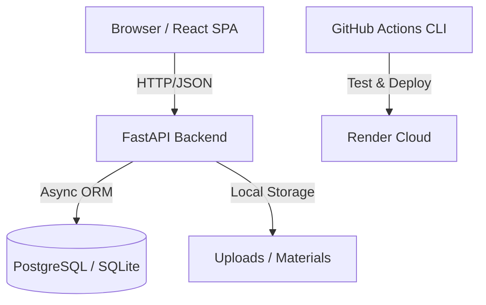

# 🌟 Little Learners Hub

An educational platform designed for children from Kindergarten to Grade 5, providing a curated collection of worksheets, activity books, drawing pages, puzzles, and interactive games.

## 📖 Problem Description
Modern education requires accessible, high-quality resources that cater to different learning styles and grade levels. **Little Learners Hub** bridges the gap between educators and parents by providing a centralized platform where:
- **Educators** can share and manage educational content.
- **Parents** can discover, download, and engage with materials for their children.
- **Children** get access to interactive and printable materials tailored to their developmental stage.

The system supports granular filtering by grade level (K-5) and material type, ensuring that every child finds exactly what they need to thrive.

---

## 🤖 AI-Assisted System Development
This project was developed using a state-of-the-art **Agentic AI Workflow**. Instead of a simple coding assistant, we utilized **Antigravity**, a powerful AI agent from Google Deepmind, capable of:
- **Autonomous Execution**: Running terminal commands, managing the filesystem, and debugging real-time.
- **Multi-Agent Coordination**: Utilizing specialized sub-agents for browser-based testing and complex research.
- **MCP Integration**: Leveraging the **Model Context Protocol (MCP)** to interact with various tools, servers, and data sources (e.g., FileSystem MCP, Command MCP).
- **Iterative Planning**: Every major feature (Dockerization, CI/CD, Unified Container) was prefaced by an AI-generated **Implementation Plan** and verified via an automated **Walkthrough**.

Check the `agent.md` file for detailed agent-specific guidance and local development shortcuts.

---

## 🏗️ System Architecture & Technologies

The system follows a modern decoupled architecture, containerized for consistent deployment.

### **Core Technologies**
- **Frontend**: [React 18](https://reactjs.org/) + [Vite](https://vitejs.dev/) + [TypeScript](https://www.typescriptlang.org/)
- **Backend**: [FastAPI](https://fastapi.tiangolo.com/) (Python 3.11) + [SQLAlchemy 2.0](https://www.sqlalchemy.org/)
- **Database**: [PostgreSQL 15](https://www.postgresql.org/) (Production) & [SQLite](https://www.sqlite.org/) (Development/Testing)
- **Styling**: [Tailwind CSS](https://tailwindcss.com/) + [Shadcn UI](https://ui.shadcn.com/)
- **Migrations**: [Alembic](https://alembic.sqlalchemy.org/)
- **Containerization**: [Docker](https://www.docker.com/) & [Docker Compose](https://docs.docker.com/compose/)
- **CI/CD**: [GitHub Actions](https://github.com/features/actions)
- **Deployment**: [Render](https://render.com/)

### **Architecture Diagram**


---

## 🔌 API Contract (OpenAPI)
The project is built on an **API-First** principle. The entire backend-frontend contract is defined in the `openapi.yaml` file. 
- **Specifications**: Fully reflects all requirements (Auth, Materials, Users, Stats).
- **Documentation**: Automatically served at `/docs` (Swagger UI) and `/redoc` (ReDoc) when the backend is running.

---

## 💻 Implementation Details

### **Frontend**
- **Structured Communication**: Centralized API logic in `src/services/api.ts` ensures a clean separation of concerns.
- **Reactive UI**: State-of-the-art UI components with micro-animations and responsive design.
- **Validation**: Strict Type-safety with TypeScript and Pydantic-matched interfaces.

### **Backend**
- **Modular Routers**: Logic split into `auth`, `users`, `materials`, and `stats`.
- **Security**: JWT-based authentication with password hashing (Bcrypt).
- **Async Efficiency**: Fully asynchronous I/O for both database and file operations.

### **Database Integration**
The system supports multiple environments seamlessly:
- **Dev/Test**: Uses `aiosqlite` for lightweight, file-based persistence.
- **Prod**: Uses `asyncpg` for high-performance PostgreSQL connections.
- **Migrations**: Database schema is versioned with Alembic, running automatically on container startup.

---

## 🐳 Containerization
The entire stack is containerized for "One-Click" setup:
- **Local Dev**: Use `docker-compose.yml` to orchestrate Frontend, Backend, and Postgres.
- **Cloud (Unified)**: For Render deployment, we use a **Unified Dockerfile** (`render.Dockerfile`) that builds the frontend assets and embeds them into the FastAPI backend service for optimized cloud resource usage.

---

## 🧪 Testing & CI/CD

### **Test Suites**
- **Unit Tests**: Cover individual Pydantic models and logic (`backend/tests/test_database.py`).
- **Integration Tests**: End-to-end backend workflows including database status and auth flow (`backend/tests/test_api.py`, `backend/tests/test_workflows.py`).
- **Frontend E2E**: Playwright tests covering critical user journeys (`e2e/integration.spec.ts`).

### **CI/CD Pipeline**
Our GitHub Actions pipeline ensures 100% reliability:
1. **Unit Tests**: Runs on every push/PR.
2. **Integration Tests**: Validates major system workflows.
3. **Automated Deployment**: If tests pass on `main`, a trigger is sent to Render to deploy the updated **Unified Container**.

---

## 🚀 How to Run & Deploy

### **1. Run with Docker (Recommended)**
```bash
docker-compose up --build
```
Access the app at `http://localhost:8080`.

### **2. Run Locally (without Docker)**
**Backend**:
```bash
cd backend
pip install .
uvicorn backend.main:app --reload
```
**Frontend**:
```bash
npm install
npm run dev
```

### **3. Run Tests**
**Backend**:
```bash
pytest backend/tests/
```
**Frontend E2E**:
```bash
npx playwright test
```

### **4. Deploy to Render**
The project includes a `render.yaml` Blueprint.
1. Push to GitHub.
2. Go to Render Dashboard -> New -> Blueprint.
3. Connect your repository and click "Apply".

---

## 📄 License
MIT License. Created with ❤️ by the KidLearn Team.
